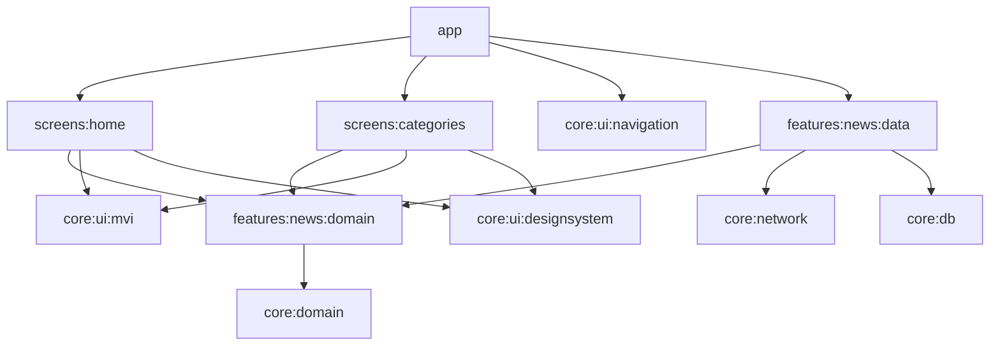

# News

News is a modular Android application for browsing the latest articles from
[NewsAPI](https://newsapi.org/). It provides a searchable news feed, category
filtering, pagination, local Room caching, and resilient loading and error
states.

## Features

- Latest US headlines
- Debounced article search
- Filtering by NewsAPI categories
- Infinite-scroll pagination with retry support
- Local cache separated by feed, search query, and category
- Cached content displayed before a network refresh
- Skeleton, empty, offline, initial-error, and inline-error states
- Bottom navigation with independent Home and Categories back stacks
- Support for `/v2/top-headlines`, `/v2/everything`, and
  `/v2/top-headlines/sources`

## Architecture

The project uses a modular, layered architecture. Presentation modules depend
on feature-domain contracts, while concrete network and database-backed
implementations live in the feature data module and are connected through
Hilt.



### MVI

Every screen follows the same unidirectional state flow:

```text
UI intent -> MviViewModel -> partial state -> reducer -> StateFlow -> UI
                                |
                                +-> SharedFlow effect
```

- `Intent` represents a user or lifecycle action.
- `ViewModel` performs asynchronous work and emits a `Partial` result.
- `Reducer` is the single place where a `Partial` transforms immutable UI
  state.
- `StateFlow` exposes the current state to Compose.
- `Effect` is available for one-time events.
- `BaseScreen` provides shared loading, content, offline, and error-state
  handling.

### Data flow

For the initial page, a screen first requests articles stored for the current
`NewsRequest`. Cached content is rendered immediately when available, after
which the repository refreshes it from NewsAPI. Successful remote pages are
written to Room in a transaction.

The cache uses an independent context key for:

- the main feed;
- each normalized search query;
- each selected category.

Subsequent pages are requested as the list approaches its end and appended to
the current context. Network failures do not remove previously cached content.

### Navigation

`MainContainer` is the root Compose screen and contains the Home and Categories
bottom-navigation destinations. Navigation is implemented with Navigation 3.
Each destination owns a separate `NavBackStack`, `ViewModelStore`, and saved
state, so switching tabs preserves its navigation and UI state.

## Module structure

```text
app
├── Application, Hilt composition root, and AppLogger binding
├── MainActivity / MainContainer / MainViewModel
└── application theme and configuration

core
├── domain
│   ├── shared models and DataResult/NetworkError
│   └── application-level abstractions
├── db
│   ├── Room database, DAO, entity, and database mapper
│   └── database Hilt module
├── logging
│   └── Timber initialization
├── network
│   ├── domain — API contract
│   └── data — Ktor client, logging, and network error mapping
└── ui
    ├── designsystem — shared Compose components and dimensions
    ├── mvi — MVI contracts, MviViewModel, and BaseScreen
    └── navigation — destinations, manager, and Navigation 3 host

features
└── news
    ├── domain
    │   ├── NewsRepository
    │   └── local and remote data-source contracts
    └── data
        ├── NewsRepositoryImpl
        ├── NewsRemoteDataSourseImpl
        ├── NewsLocalDataSourseImpl
        ├── API DTOs and mappers
        └── Hilt bindings

screens
├── home — latest headlines, search, and pagination
└── categories — category selection and paginated articles
```

## Main technology stack

| Area | Technology |
| --- | --- |
| Language | Kotlin 2.4.20 |
| UI | Jetpack Compose, Material 3 |
| Architecture | MVI, repository pattern, modular layered architecture |
| Async/state | Kotlin Coroutines, Flow, StateFlow, SharedFlow |
| Navigation | AndroidX Navigation 3 |
| Dependency injection | Hilt with KSP |
| Networking | Ktor Client with OkHttp engine |
| Serialization | Kotlinx Serialization |
| Persistence | Room |
| Image loading | Coil 3 |
| Logging | Timber |
| Testing | JUnit 4, kotlinx-coroutines-test |

The application targets Android API 37, supports API 29 and newer, and uses
Java 11 bytecode compatibility.

## Configuration

1. Create an API key at [newsapi.org](https://newsapi.org/).
2. Set the local value in `gradle/libs.versions.toml`:

   ```toml
   [versions]
   baseUrl = "https://newsapi.org/v2"
   apiKey = "YOUR_NEWS_API_KEY"
   ```

The values are exposed to the app through generated `BuildConfig` fields. Do
not commit a production API key to a public repository.

## Build and verification

Open the project in Android Studio and use a JDK compatible with the configured
Android Gradle Plugin. The main Gradle commands are:

```bash
# Build the debug APK
./gradlew :app:assembleDebug

# Run all debug unit tests
./gradlew testDebugUnitTest

# Run Android lint
./gradlew lintDebug

# Run the complete local verification used by the project
./gradlew testDebugUnitTest lintDebug :app:assembleDebug
```

The generated debug APK is available at:

```text
app/build/outputs/apk/debug/app-debug.apk
```

## Testing

The current unit-test suite covers:

- MVI reducers and ViewModel state transitions;
- pagination and retry scenarios;
- navigation-manager behavior;
- repository cache and remote-source coordination;
- Room entity mapping;
- API/domain mapping and network error classification.
